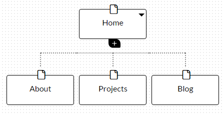

# Week 2: Design Reflections

### What are the 6 Phases of Web Design? ###
1. Information Gathering
	* Modern web design revolves around the user. Thus, learning about your own goals and learning about the people who will be visiting your site is one of the very first steps. Reflect on the purpose of your site, the goals you want to achieve, your target audience, and the kind of content you want to deliver.
2. Planning
	* While the first step was a brainstorm of the high-level details, planning involves defining some of the mid-level organizational choices involving your website. How will your website be structured in terms of its pages? What is the general design of the web interface? What technologies will be needed to implement all of this? Finally, does all of this organization benefit your target users?
3. Design
	* This stage combines both defining the lower level specifics of how each element in your website will be displayed, as well as the design implementation of the website. This section includes creating prototypes and mock-ups, finalizing the layout and look of the UI, as well as formalizing the design guidelines that unify the site's looks.
4. Development
	* Here is where the logic of your website is implemented through scripts, programs, and databases. HTML, CSS, Javascript, Ruby, SQL, and a number of other languages and tools are used to transform a website from a picture mock-up to an interactive site. Content is added to the site and systems like WordPress are setup. 
5. Testing and Delivery
	* Here, the product is mostly completed, but the edges must be smoothed out in this stage. Support for multiple browsers, screens, and devices must be tested in this stage. Logic must be tested through many cases to catch bugs and unintended logic. Web standards are checked to ensure all syntax complies. After testing, the deliverables are sent up to your server for your website to be displayed to the world. Some minor tweaks happen after deployment, but for the most part, the website is complete.
6. Maintenance
	* Websites do not just stop developing after they are pushed to a server for the first time. Maintaining various parts of the website, such as through updating content, updating the software and code that powers your website, and extending the website's capabilities are all part of post-delivery maintenance.

### What is your site's primary goal or purpose? What kind of content will your site feature? ###

My site's purpose is to be an online resume and a personal website to casually blog with. Inspired by [this collection of personal websites](https://www.themuse.com/advice/the-35-best-personal-websites-weve-ever-seen), I want to be able to display my knowledge of web technologies in a tasteful manner, displaying my credentials, while also hosting a blog full of content relating to reflections on web technologies.

### What is your target audience's interests and how do you see your site addressing them? ###

My target audience will primarily target a professional audience based in web technologies, including both potential employers and individuals curious about my journey through the tech world. The front page and projects page will address employers by showing my portfolio and credentials, while both may be interested in my comments on technology in general.

### What is the primary "action" the user should take when coming to your site? Do you want them to search for information, contact you, or see your portfolio? ###

The most rewarding goal is to encourage contact from potential employers and individuals wanting to talk about my blog posts. However, I mainly want most visitors on the site to absorb the front page, which will be a concise summary of the site, with perhaps them checking out the other pages too.

### What are the main things someone should know about design and user experience? ###

Always learn about the people viewing your site. Whether through interviews, surveys, A/B testing, or some other means of feedback, knowing your audience is key. This will shape the design decisions from step one until the end, making sure each part of the website fulfills some need of the user. After the user is taken care of, a unified design plan is critical, where usually less is more. While this helps simplify your website and lowers its load on people's browsers, it also forces the designer to make conscious decisions about what is absolutely necessary to have on the website.

### What is user experience design and why is it valuable? ###

User experience design is the process by which a website is optimized for a user, in terms of maximizing not only the usability of a website, but also the appeal and the ability for a website to be used by multiple users, such as ones with disabilities or by people on mobile devices. By optimizing these qualities, users will stay longer on a website while also feeling encouraged to perform critical actions on that website, such as purchasing an item. 

### Which parts of the challenge did you find tedious? ###

The most tedious part has to be some of the reading. Don't get me wrong, it's all very informative, but it's a bit disappointing to see multiple dead links on a website. Aside from that, the challenge was fairly straightforward and was good practice for using Markdown.

### Site Map (Updated 1/5/2016)

The sitemap right now is fairly basic, but I want to make sure that these core parts are developed first before adding anything else. The homepage serves the needs of people looking for my summary, while the about page provides an in-detail description. The projects are meant to showcase my credentials in a concrete manner, while the blog is meant to show my growth throughout the bootcamp. The sitemap is simple at this point so that every individual can't possibly get lost or wonder where a piece of information is.

