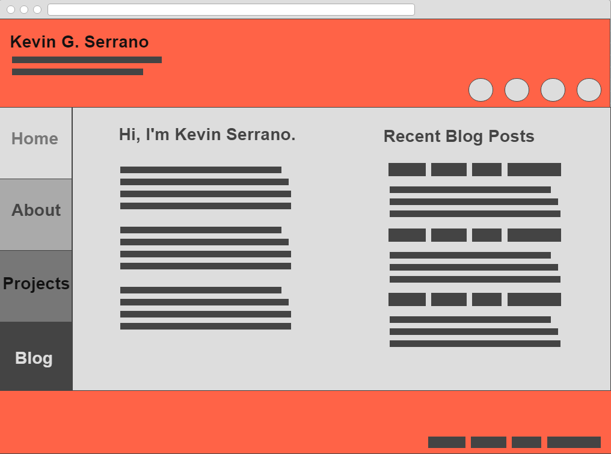
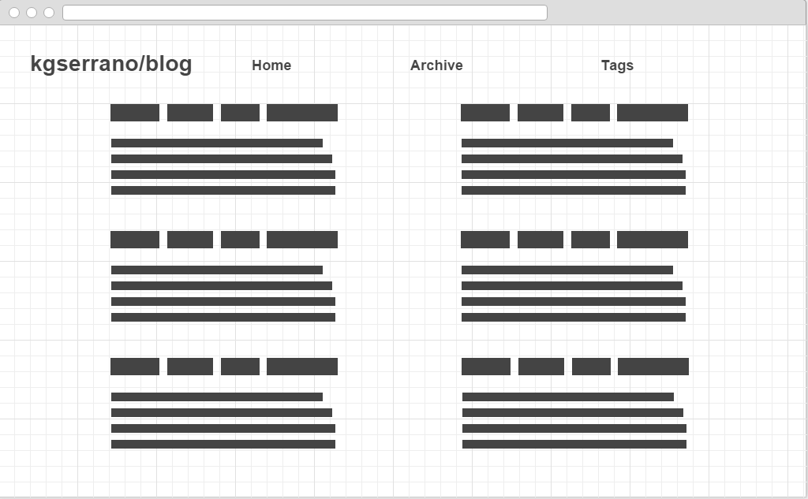

# 2.4 Wireframe Reflection

## Phase 0 index.html Wireframe

## Zanibas.github.io Blog Wireframe

## Reflection Questions

+ What is a wireframe?
	+ A **wireframe**, in the context of web development, is the rough sketch of a website's high level layout. It determines the relative placement of elements such as the **header**, **footer**, **sidebar**, and main content, as well as the general design of elements within those frames. Wireframes are meant to be **low-fidelity prototypes**, meaning that they deliberately lack detail in order to focus on the larger picture and for rapid iteration.
+ What are the benefits of wireframing?
	+ As said above, a wireframe is a low-fidelity prototype that allows for multiple wireframes to be developed in a short time period. Thus, rapid assessment of your wireframes is possible as well as the ability to visually test-drive multiple possible layouts. By focusing on these details instead of nitty gritty stuff such as colors, fonts, and specific images, the workflow for this stage is streamlined.
+ Did you enjoy wireframing your site?
	+ Wireframing is probably one of my least liked parts of the web development process so far, only because it's just a picture. When I read on one of the required readings that a company decided to forgo most of the prototyping stage into actual code, I agreed with that philosophy a lot. I see the importance of at least wireframing, but the real joy for me is seeing the website grow through our code.
+ Did you revise your wireframe or stick with your first idea?
	+ I did some minor revisions, especially for my front page website, but I foresee more refinement in the future. Due to my lack of actual design experience, I may not have the eye for designing yet, but as we progress through the course, I believe this site will change dramatically from this initial wireframe.
+ What questions did you ask during this challenge?
	+ Why do we wireframe? How much detail is enough detail? How will my users be able to navigate my website effectively and read the content easily without the site turning into too standard of a format? 
+ What resources did you find to help you answer them?
	+ Some rabbit-holing through smashing magazine's various links (some of which were dead, which annoys me so much), which really helped cement the user-centered design philosophy into my line of thinking. At the same time though, I feel that experience will be needed if I truly want to make a unique while functional website.
+ Which parts of the challenge did you enjoy and which parts did you find tedious?
	+ I enjoyed thinking of the general design of the website, but it was tedious to use some of the tools, especially since they're web based and not fully featured. I will have to find other wireframing applications in the future to really find the right fit for my needs.