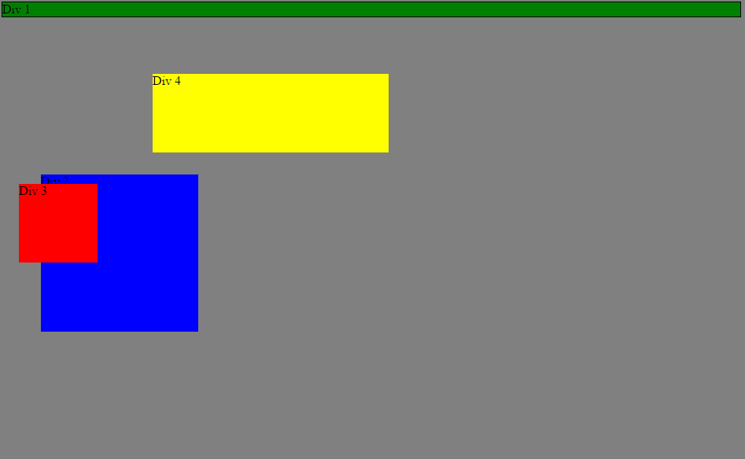
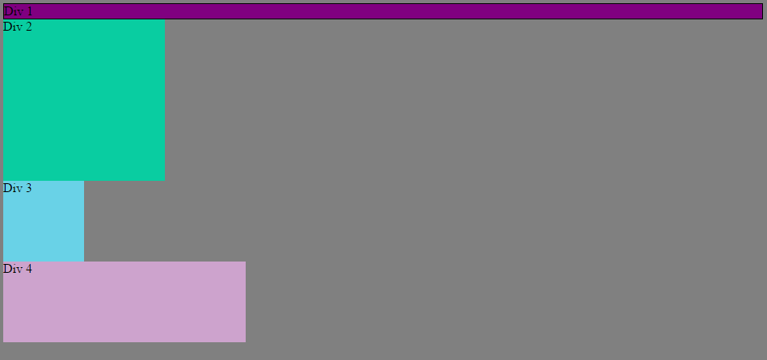
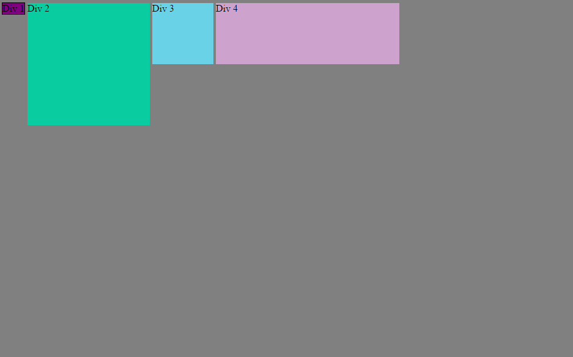
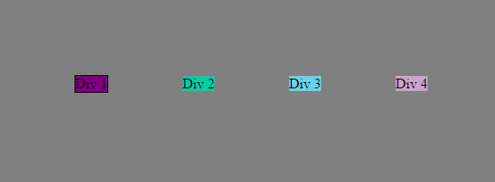
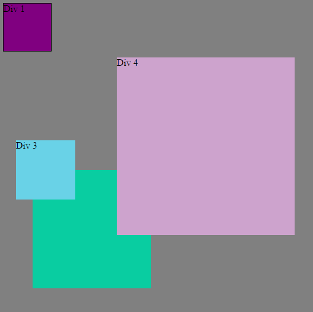
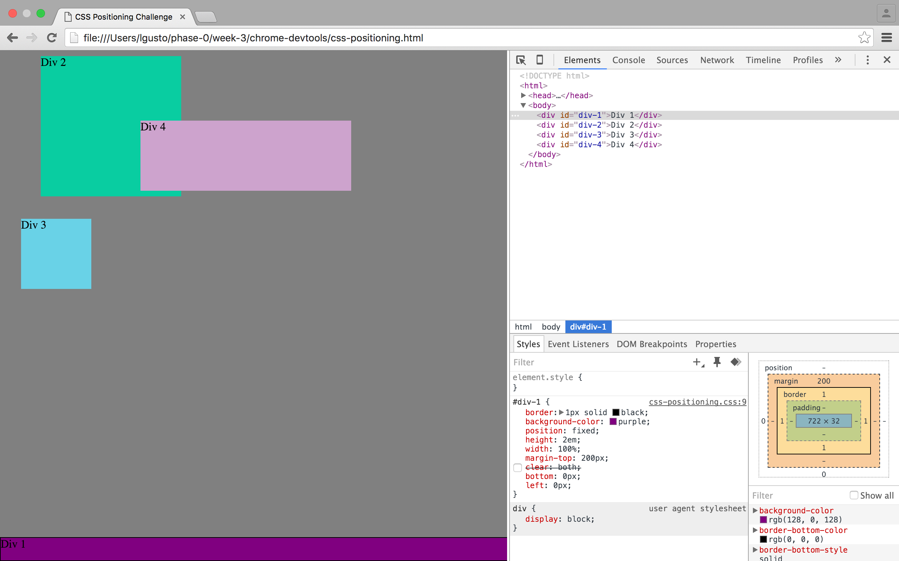
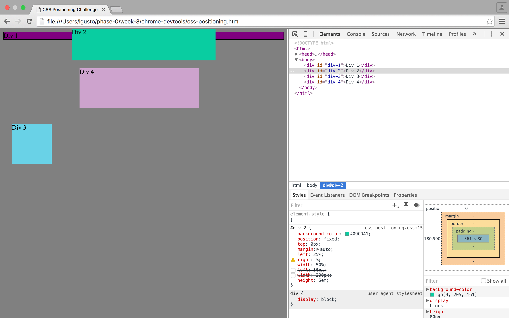
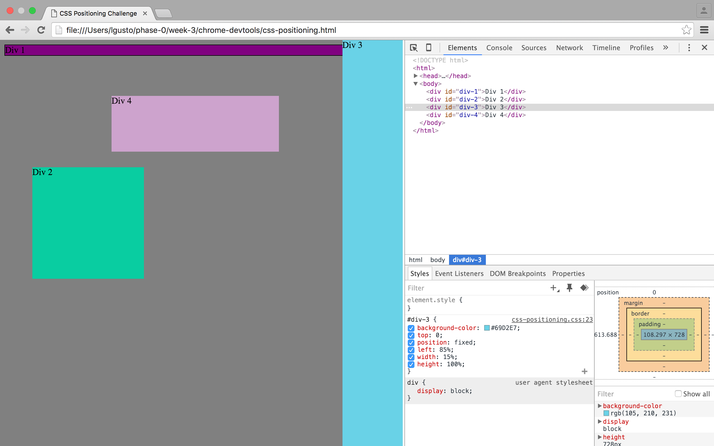
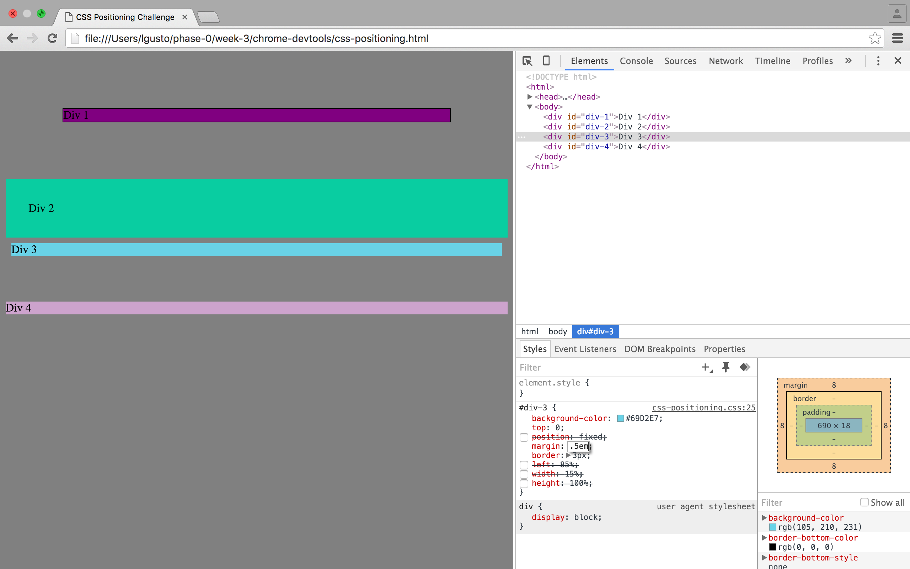

# 3.4 Chrome DevTools Reflection

## Images

Image 1

Image 2

Image 3

Image 4

Image 5

Image 6

Image 7

Image 8

Image 9

## Questions

+ How can you use Chrome's DevTools inspector to help you format or position elements?
  + First, the most helpful element by far would be the inspector tool. Being able to see the box model for any element and its coresponding styles is majorly useful, especialy since the console shows what styles have been overriden by other rules.
  + Second, being able to adjust CSS styles directly in the console is super useful in quickly prototyping and testing different styles without having to go and edit the source code and reloading the browser window.
  + Finally, The DevTools quickly show the source code of the HTML as well, allowing for quick notice of what elements are nested where.
+ How can you resize elements on the DOM using CSS?
  + To resize elements, you would proceed to click on the element you'd like to resize on the DOM. From there, you would look at the CSS column and find the styles applied to the specific element. If width and height properties are already present, change those. If not, you would click near the bottom of the list of properties and add your own rule by typing out the property to change and then its value.
+ What are the differences between absolute, fixed, static, and relative positioning? Which did you find easiest to use? Which was most difficult?
  + **Static positioning** is the default position value assigned to elements. This assigns the placement of the element to the browser, which will fit it into the flow of the page. This is useful positioning for simplifying your CSS and not worrying about exact placement, instead allowing the HTML to resolve the positioning.
  + **Relative positioning** is a step above static. After the browser fits the element into the flow of the page, adjustments to the position can be made using top, bottom, left, and right, where it will move relative to the position it flows naturally on the web page. This is useful over static when you wish to make finer adjustments to the position, such as flowing images into the text of an article.
  + **Absolute positioning** is like relative positioning, except its relative point of reference is in relation to its closest parent that has a non-static position set. If not, then it is relatively placed to the HTML document as a whole. If you want your elements to be anchored in a specific way to an element, this is the position style you want.
  + **Fixed positioning** is like absolute positioning, except it anchors itself to the current viewpoint. Scrolling up and down will not change its position, since it is relative to the window, rather than the HTML document. Its position can be adjusted just like relative and absolute. Use this for items you don't want to disappear with scrolling, such as a sidebar that stays visible when the user scrolls down.
+ What are the differences between margin, border, and padding?
  + All three create distance between an element's 'core' and other elements, but the differences are as follows.
  +  **Margin** is the space between the border of an element and the margin of other elements.
  + **Border** is the space between the margin of the element and the padding. This space is usually the size of only a few pixels and if used, is typically colored, like a border.
  + **Padding** is the space between the core of the element and the border. It is the innermost space before the actual element itself.
+ What was your impression of this challenge overall? (love, hate, and why?)
  + I loved this challenge! It was cool using the DevTools to be creative with the CSS, much like a GUI. It allowed us to explore CSS concepts we were not comfortable with and allowed rapid testing of various properties in order to figure out how they work. I love rapid iteration through testing like this and it has encouraged me to use the DevTools more often in the future.