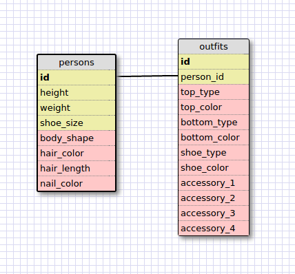

# 8.4: Introduction to Databse Schemas and SQL

## Release 5: SELECTing data from a database

1. Select all data for all states.
    * SELECT * FROM states;
2. Select all data for all regions.
	* SELECT * FROM regions;
3. Select the state_name and population for all states.
	* SELECT state_name, population FROM states;
4. Select the state_name and population for all states ordered by population. The state with the highest population should be at the top.
	* SELECT state_name, population FROM states ORDER BY population DESC;
5. Select the state_name for the states in region 7.
	* SELECT state_name FROM states WHERE region_id = 7;
6. Select the state_name and population_density for states with a population density over 50 ordered from least to most dense.
	* SELECT state_name, population_density FROM states WHERE population_density > 50 ORDER BY population_density ASC;
7. Select the state_name for states with a population between 1 million and 1.5 million people.
	* SELECT state_name FROM states WHERE population > 1000000 AND population < 1500000;
8. Select the state_name and region_id for states ordered by region in ascending order.
	* SELECT state_name, region_id FROM states ORDER BY region_id ASC;
9. Select the region_name for the regions with "Central" in the name.
	* SELECT region_name FROM regions WHERE region_name LIKE '%central%';
10. Select the region_name and the statename for all states and regions in ascending order by region_id. Refer to the region by name. (This will involve joining the tables).
	* SELECT regions.region_name, states.state_name FROM regions JOIN states ON regions.id = states.region_id ORDER BY states.region_id ASC;

## Release 6: Your Own Schema

## Release 7: Reflection

1. What are databases for?
	* Databases are an efficient way of storing and retrieving large amounts of data.
	* This is especially useful when we need to only reference specific parts of our dataset at a time.
2. What is a one-to-many relationship?
	* When we have elements of a dataset that can be categorized into a more general grouping that has several other elements of the dataset within it, it's a one-to-many relationship. 
3. What is a primary key? What is a foreign key? How can you determine which is which?
	* A primary key is a key in a database that is a unique identifier for each element. No other element in the database can share this key. With this in mind, a foreign key refers to a unique primary key. Several foreign keys in a table can point to another table's unique primary key, but multiple primary keys cannot point to that same foreign key, since the foreign key points uniquely to one entry in the primary key's table.
4. How can you select information out of a SQL database? What are some general guidelines for that?
	* Selecting information out of a SQL database is primarily done through the SELECT x IN table selector. The guidelines are that commands are capitalized, fields are in undercase and use underscores to separate words, and long queries should be segmented into logical parts on newlines whenever possible.