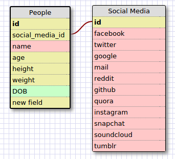
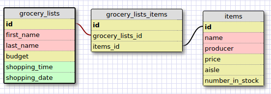

# 8.5: More Schemas

## Release 2: Create a One-to-one Schema

Here's a schema for people with social media accounts. Not everyone will have
every social media account or even any at all, so we create a one-to-one
relationship because every social media account is unique to a person.

## Release 4: Refactor

A schema for grocery lists and their items in a many-to-many schema.

